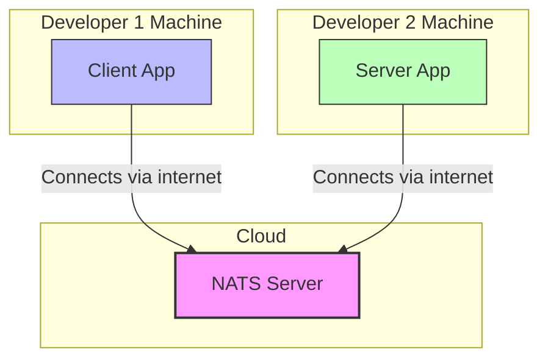
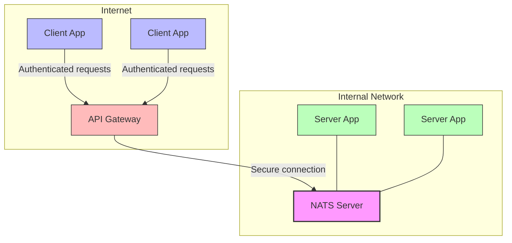

# NATS Architecture for Distributed Applications

Developing modern applications often involves creating distributed systems where clients and servers need to communicate effectively. This guide explains how to use NATS as a messaging system to develop, test, and deploy your distributed applications with Magic Button.

## What is NATS?

NATS is a simple, secure, and high-performance messaging system for cloud-native applications, IoT messaging, and microservices architectures. It acts as a message bus that allows different parts of your application to communicate without being directly connected.

## Why Use NATS with Magic Button?

1. **Independent Development** - Develop client and server applications separately
2. **Flexible Deployment** - Transition seamlessly from development to production
3. **Secure Communication** - Control access to your messaging system
4. **Scalable Architecture** - Easily scale as your application grows

## Development Architecture

During development and early piloting, you can use a cloud-hosted NATS server:



In this setup:
- Developers can work independently on client and server components
- The NATS server in the cloud acts as a central communication hub
- Applications connect to NATS using secure authentication
- Development can happen anywhere with internet access

## Production Architecture

When you're ready to handle sensitive data and move to production, you can deploy NATS on your internal network:



In this setup:
- NATS server is deployed on your internal network
- Servers connect directly to NATS within your network
- Clients connect through an API gateway
- All sensitive data stays within your protected network

## How It Works with Magic Button

Magic Button's messaging system works perfectly with NATS through its transport abstraction:

1. **Define Your Contracts** - Create type-safe contracts using Magic Button's contract system
2. **Configure Transport** - Set up the NATS transport adapter
3. **Create Clients and Servers** - Use Magic Button's client and server classes
4. **Connect and Communicate** - Everything works together seamlessly!

## Getting Started

### 1. Set Up a NATS Server for Development

You can use a free tier from a cloud provider or run one locally using Docker:

```bash
docker run -p 4222:4222 -p 8222:8222 nats
```

### 2. Configure Your Magic Button Client

```typescript
import { createMessagingClient } from '@magicbutton/messaging';
import { NatsTransport } from '@magicbutton/nats-transport';
import { yourContract } from './your-contract';

// For development
const client = createMessagingClient({
  transport: new NatsTransport({
    servers: ['nats://your-cloud-nats-server:4222'],
    authentication: {
      user: 'dev-user',
      password: 'dev-password'
    }
  }),
  contract: yourContract
});

// Connect to the server
await client.connect();

// Make requests and subscribe to events
const response = await client.request('yourRequest', { data: 'example' });
client.subscribe('yourEvent', (data) => {
  console.log('Event received:', data);
});
```

### 3. Configure Your Magic Button Server

```typescript
import { createMessagingServer } from '@magicbutton/messaging';
import { NatsTransport } from '@magicbutton/nats-transport';
import { yourContract } from './your-contract';

// For development
const server = createMessagingServer({
  transport: new NatsTransport({
    servers: ['nats://your-cloud-nats-server:4222'],
    authentication: {
      user: 'dev-user',
      password: 'dev-password'
    }
  }),
  contract: yourContract
});

// Register request handlers
server.registerHandler('yourRequest', async (request) => {
  return { result: 'success' };
});

// Start the server
await server.start();

// Broadcast events
server.broadcast('yourEvent', { message: 'Something happened!' });
```

## Transitioning to Production

When moving to production, simply update your transport configuration:

```typescript
// For production
const transport = new NatsTransport({
  servers: ['nats://internal-nats-server:4222'],
  authentication: {
    // Use stronger authentication in production
    tls: {
      caFile: '/path/to/ca.pem',
      certFile: '/path/to/cert.pem',
      keyFile: '/path/to/key.pem'
    }
  }
});
```

## Security Considerations

1. **Development** - Use basic authentication during development
2. **Production** - Use TLS certificates and deploy on internal networks
3. **Access Control** - Use Magic Button's access control system to restrict who can do what
4. **Encryption** - Consider encrypting sensitive message payloads

## Conclusion

Using NATS with Magic Button provides a flexible, secure way to develop distributed applications. You can start with a simple cloud-based setup for development and easily transition to a more secure, internal setup for production.

The beauty of this approach is that your application code doesn't change - only the transport configuration needs to be updated when moving between environments.