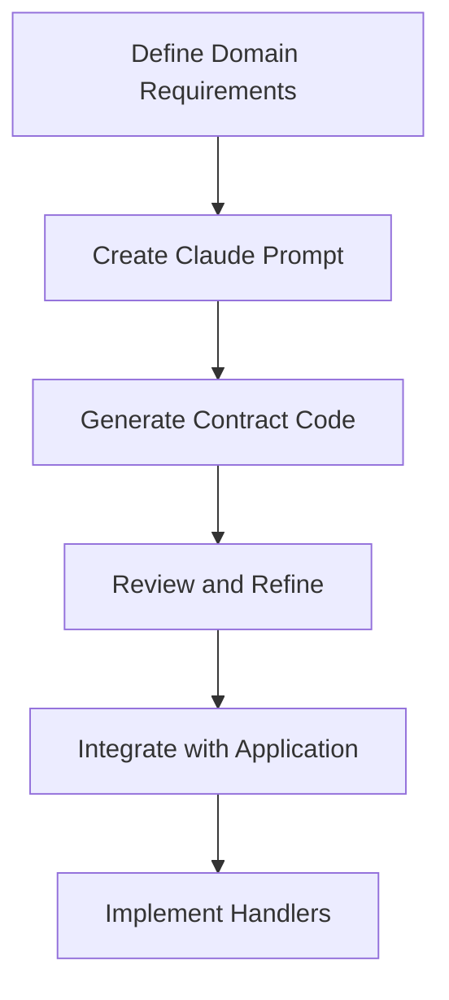
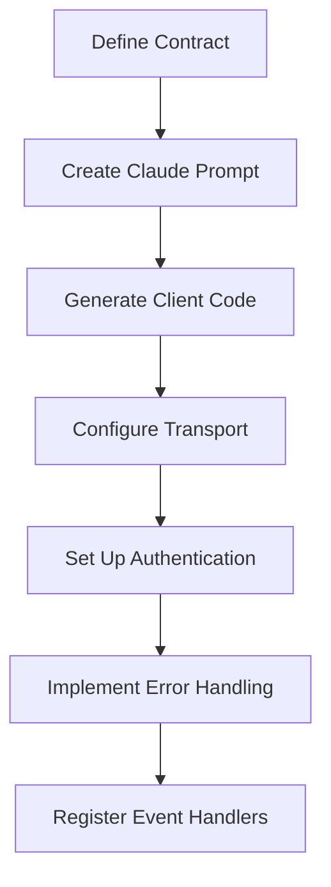
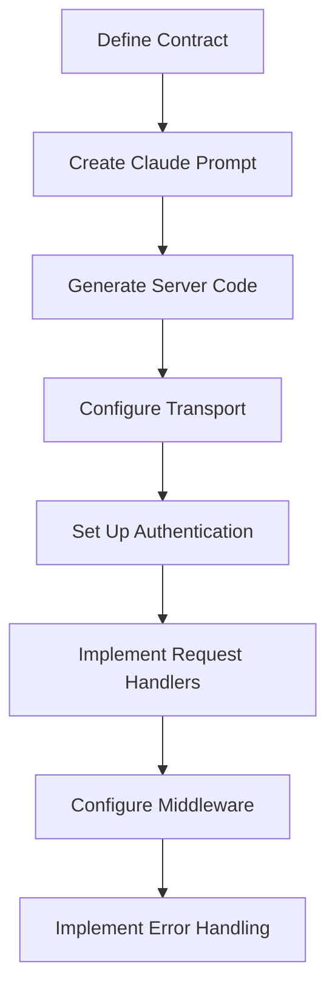

# Claude Integration Patterns

This guide outlines common patterns for integrating Claude with Magic Button Cloud applications.

## Contract Generation Workflow

A typical workflow for using Claude to generate contracts looks like this:



1. **Define Domain Requirements**: Document your domain entities, events, and operations
2. **Create Claude Prompt**: Use the contract generation template
3. **Generate Contract Code**: Submit the prompt to Claude
4. **Review and Refine**: Verify schema definitions and validations
5. **Integrate with Application**: Import the contract into your codebase
6. **Implement Handlers**: Create handlers for the defined requests

## Client Implementation Pattern

For generating client implementations:



## Server Implementation Pattern

For generating server implementations:



## Integration Architectures

### Direct Integration

```
┌───────────┐     ┌───────────┐     ┌───────────┐
│           │     │           │     │           │
│ Your App  │◄────┤   Claude  │◄────┤ Generated │
│           │     │           │     │   Code    │
└───────────┘     └───────────┘     └───────────┘
```

In this pattern, your application interacts directly with Claude to generate code that is then integrated into your application.

### Assisted Development Workflow

```
┌───────────┐     ┌───────────┐     ┌───────────┐     ┌───────────┐
│           │     │           │     │           │     │           │
│ Developer │◄────┤   Claude  │◄────┤ Generated │◄────┤ Magic     │
│           │     │           │     │   Code    │     │ Button    │
└───────────┘     └───────────┘     └───────────┘     └───────────┘
```

In this pattern, developers use Claude during the development process to generate code that integrates with Magic Button Cloud.

### Runtime Integration

```
┌───────────┐     ┌───────────┐     ┌───────────┐
│           │     │           │     │           │
│ Your App  │◄────┤Magic Button│◄────┤  Claude   │
│           │     │    Cloud   │     │           │
└───────────┘     └───────────┘     └───────────┘
```

In this pattern, Claude is integrated at runtime, with Magic Button Cloud acting as the intermediary.

## Version Control Integration

When integrating Claude-generated code with your version control system:

1. **Separate Generated Code**: Keep Claude-generated code in separate files
2. **Code Review**: Always review generated code before committing
3. **Iterative Refinement**: Use Claude to improve existing code iteratively
4. **Documentation**: Document which parts of your codebase are Claude-generated

## Continuous Integration

For CI/CD pipelines:

1. **Generate Tests**: Use Claude to generate tests for your contracts
2. **Validation Checks**: Verify that generated code adheres to your coding standards
3. **Documentation Updates**: Automatically update documentation when contracts change

## Best Practices

- **Review All Generated Code**: Always review Claude-generated code before using it in production
- **Iterative Development**: Use Claude in an iterative fashion to refine your code
- **Keep Context**: Maintain context between related prompts for better continuity
- **Combine with Human Expertise**: Use Claude as a tool to enhance developer productivity, not replace human judgment
- **Version Control**: Track Claude-generated code in version control with clear attribution

## Example Workflow

Here's a complete example workflow for using Claude with Magic Button Cloud:

1. **Define Domain Model**:
   - Document domain entities and their relationships
   - Identify events, commands, and queries
   - Define validation rules

2. **Generate Contract**:
   - Use the contract generation prompt
   - Provide domain context and requirements

3. **Generate Client and Server**:
   - Use the client and server generation prompts
   - Configure with appropriate transport and authentication

4. **Implement Business Logic**:
   - Add custom business logic to request handlers
   - Set up appropriate middleware

5. **Generate Tests**:
   - Use the testing prompts to create comprehensive tests

6. **Deploy and Monitor**:
   - Deploy your application
   - Use observability tools to monitor performance