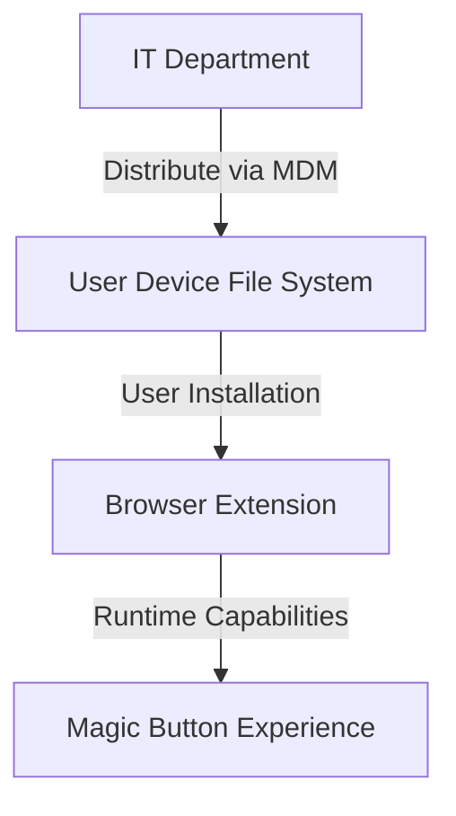
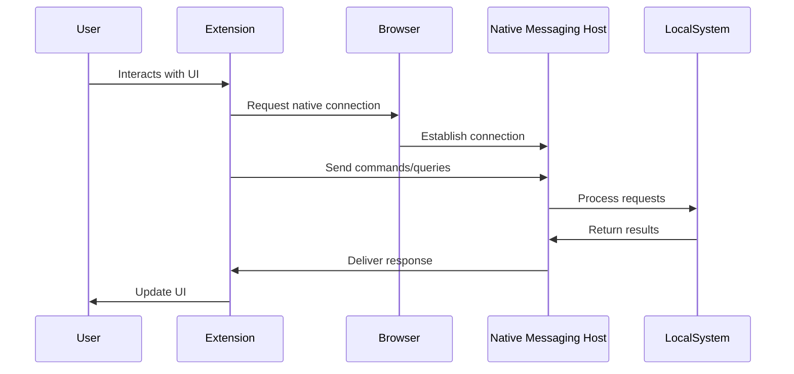
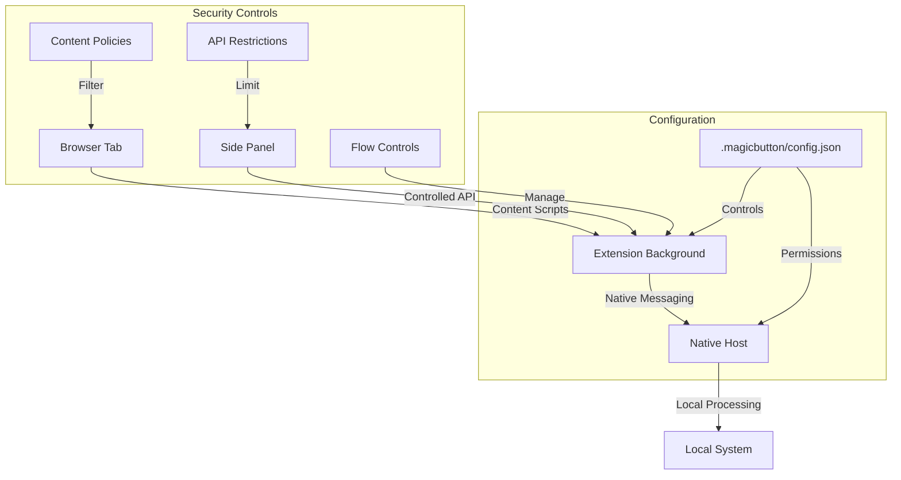

# Magic Button Browser Extension

The Magic Button Browser Extension provides a powerful yet secure way to integrate AI capabilities directly into your web browsing experience. This document explains how the extension works, its security model, and integration capabilities.

## Secure Distribution Model

One of the key advantages of the Magic Button Browser Extension is its enterprise-ready distribution model:

- **Managed Distribution**: The extension is distributed through file system using enterprise device management systems like SCCM, Microsoft Intune, and similar MDM solutions
- **No Public Store Dependency**: Avoids the risks and limitations of public extension stores
- **Versioning Control**: IT departments can precisely control which version is deployed across the organization

## Installation Flexibility

While distribution is controlled, installation provides flexibility for end users:

- **Developer Mode Installation**: Users can install the extension through the browser's developer experience
- **Zip Deployment**: Simply navigate to your browser's extension management page and drop in the extension zip file
- **No Developer Account Required**: Doesn't require a developer account with browser vendors

## Configuration Security

The extension follows a secure local configuration approach:

- **Local Configuration**: All configuration settings are stored in the `.magicbutton` folder in the user's home directory
- **Policy Enforcement**: Configuration files define strict policies that control information flow
- **Sandboxing**: Granular control over what can flow between content pages, sidepanels, and embedded iframes
- **Enterprise Control**: IT departments can pre-configure and lock down settings via policies

## MCP Client Architecture

The Magic Button Extension functions as a Model Control Protocol (MCP) client:

- **Native Messaging**: Communicates with the local system through browser's Native Messaging API
- **Local Session State**: Updates session state locally for enhanced performance and privacy
- **Bidirectional Communication**: Enables connections from extension to host system and vice versa
- **Secure IPC**: All inter-process communication follows strict security protocols

## Extension Architecture

The Magic Button Browser Extension is designed with a multi-layered architecture that enforces security while providing powerful capabilities:

## Information Flow

The extension implements careful controls over data flow between different contexts:

- **Content to Sidepanel**: Controlled by specific policies defining what page content can be shared
- **Sidepanel to Embedded Pages**: Restricted communication channels with explicit permissions
- **Extension to Native Host**: Limited to specific message types defined in configuration
- **Native Host to System**: Sandboxed execution with explicit capability grants

## Integration Capabilities

Despite strong security controls, the Magic Button Browser Extension offers powerful integration capabilities:

- **Page Context Awareness**: Can understand and interact with the current page content
- **AI Processing**: Connect to local or remote AI services for content processing
- **Local Tool Integration**: Execute controlled local tooling through the native messaging bridge
- **Authentication Binding**: Can integrate with enterprise identity systems
- **Workspace Awareness**: Maintains consistent context across browsing sessions

## Getting Started

To begin using the Magic Button Browser Extension in your environment:

1. Obtain the extension package from your IT department or authorized source
2. Navigate to your browser's extension management page
3. Enable Developer Mode
4. Drag and drop the extension zip file onto the extensions page
5. Configure the `.magicbutton` folder in your home directory with appropriate settings
6. Restart your browser to activate all features

For detailed configuration options, see the [Configuration Guide](../configuration/overview.md).