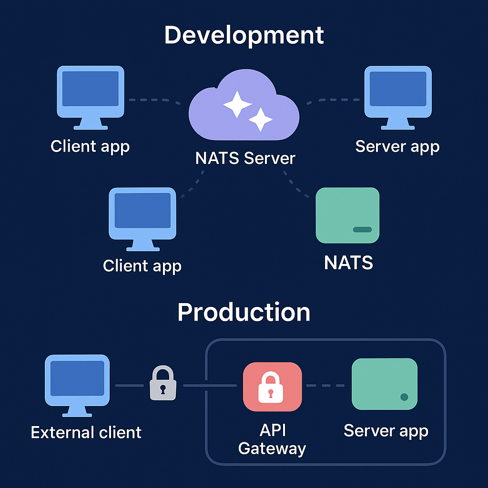

# Magic Button Cloud

Welcome to the **Magic Button Cloud** documentation. Magic Button Cloud is a comprehensive platform that provides powerful tools and libraries for building modern, distributed applications.

## What is Magic Button Cloud?

Magic Button Cloud is a suite of developer tools and libraries designed to simplify the development of complex, distributed applications. Our platform offers:

1. **Client-Focused Framework**: Build client applications with our libraries designed for seamless integration
2. **Type-Safe Communication**: Build robust inter-service communication with contract-first design
3. **Authentication & Authorization**: Implement secure, flexible auth systems with minimal effort
4. **State Management**: Distributed, type-safe state with synchronization and persistence
5. **Distributed Systems Tools**: Solve common distributed systems challenges with purpose-built libraries
6. **Developer Experience**: Enhance productivity with tools that prioritize developer experience
7. **Enterprise Features**: Robust security, compliance, and scalability features for enterprise needs

## Key Components

Magic Button Cloud includes several key components:

### Magic Button Messaging

A client-focused, type-safe framework for distributed systems communication. It provides a robust foundation for building scalable, maintainable, and secure communication between distributed system components with an emphasis on exceptional developer experience.

[Learn more about Magic Button Messaging →](messaging/overview)

### Magic Button Auth

A comprehensive authentication and authorization solution for TypeScript and React applications. It provides seamless identity management, access control, and security features with support for multiple authentication methods.

[Learn more about Magic Button Auth →](auth/overview)

### Magic Button State

A distributed state management system for TypeScript and React applications. It provides robust, type-safe state management with support for synchronization across clients, persistence, and real-time updates.

[Learn more about Magic Button State →](state/overview)

### Coming Soon

We're actively developing additional components for the Magic Button Cloud platform:

- **Magic Button Observability**: A unified observability platform for distributed applications

## Why Magic Button Cloud?

### Challenges of Modern Applications

Building modern applications comes with numerous challenges:

- **Distributed Architecture**: Managing communication between services
- **Type Safety**: Ensuring consistency across service boundaries
- **Authentication & Security**: Implementing secure authentication and authorization
- **State Management**: Maintaining consistent state across distributed components
- **Scalability**: Building systems that can scale with demand
- **Resilience**: Creating robust applications that handle failures gracefully
- **Developer Productivity**: Maintaining high developer velocity while tackling complex problems
- **Client Integration**: Seamlessly integrating with various client frameworks

### The Magic Button Solution

Magic Button Cloud addresses these challenges with:

- **Client-First Design**: Optimized for client applications with minimal dependencies and flexible integration
- **Contract-First Design**: Define your system's contracts with complete type safety
- **Secure Authentication**: Implement authentication and authorization with minimal effort
- **Distributed State**: Manage application state across multiple clients with automatic synchronization
- **Pluggable Architecture**: Adapt to your specific needs with modular, pluggable components
- **Full TypeScript Support**: Get end-to-end type safety and excellent developer experience
- **Best Practices Built-In**: Benefit from patterns and practices proven in production systems
- **Comprehensive Documentation**: Learn quickly with detailed guides and examples
- **Enterprise Readiness**: Robust features for security, compliance, and scalability in enterprise environments

## Enterprise Features

Magic Button Cloud includes enterprise-grade features designed for organizations with complex requirements:

- **Advanced Security**: Enhanced authentication, fine-grained access control, and security monitoring
- **Compliance Tools**: Audit logging, data governance, and regulatory compliance support
- **High Availability**: Redundancy, failover, and performance optimizations for mission-critical applications
- **Enterprise Integration**: Connect with legacy systems, ESBs, and enterprise databases
- **Management Console**: Centralized infrastructure management and monitoring

[Learn more about Enterprise Features →](messaging/features/enterprise)

## Certification Program

The Magic Button Certification Program provides a structured path for individuals and organizations to validate their expertise in implementing and working with Magic Button Cloud technologies.

- **Professional Certification**: Validate your ability to implement Magic Button solutions
- **Enterprise Architect Certification**: Advanced credential for designing enterprise-grade solutions
- **Security Specialist Certification**: Specialized certification for security professionals

[Learn more about Certification →](certification/overview)

## Get Started

Ready to explore Magic Button Cloud? Start with our libraries:

- [Client-Focused Framework](client-focus): Understand our client-first approach
- [Messaging Overview](messaging/overview): Learn about the Messaging library
- [Auth Overview](auth/overview): Learn about the Auth library
- [State Overview](state/overview): Learn about the State library
- [Messaging Installation](messaging/installation): Install the Messaging library
- [Auth Installation](auth/installation): Install the Auth library
- [Messaging Quick Start](messaging/quick-start): Build your first application with Magic Button Messaging
- [Auth Quick Start](auth/quick-start): Implement authentication with Magic Button Auth

## Community and Support

- **GitHub**: [https://github.com/magicbutton/magicbutton.cloud](https://github.com/magicbutton/magicbutton.cloud)
- **Discord**: Join our community on Discord [coming soon]
- **Twitter**: Follow us [@magicbuttoncloud](https://twitter.com/magicbuttoncloud)
- **Email Support**: support@magicbutton.cloud